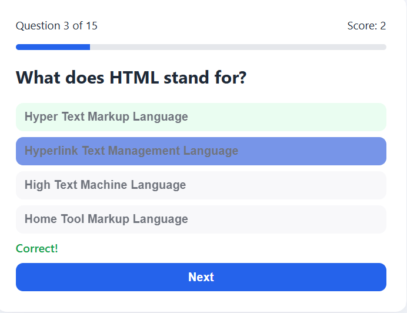
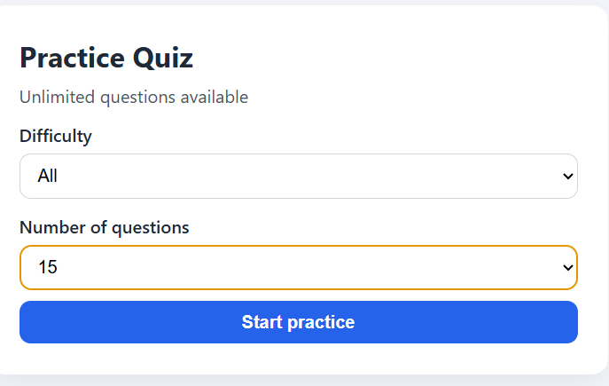

# Practice Quiz

A simple browser quiz app. Questions are generated as you play, so you can practice as many times as you want.
## Demo

## Files

- `index.html` — page structure
- `style.css` — layout and styles
- `script.js` — quiz logic and question generator

## How to run

1. Keep all three files in the same folder.
2. Open `index.html` in a browser.
3. No install and no server are required.

## Features

- Unlimited questions (new ones are created each session)
- Practice length: **15**, **30**, **50**, or **100** questions
- Difficulty: Easy, Medium, Hard, or All
- Answer options are shuffled
- Instant correct / wrong feedback
- Score and progress bar
- Final result screen

## How to use

1. Choose a difficulty.
2. Choose how many questions you want (15, 30, 50, or 100).
3. Click **Start practice**.
4. Select an answer, then click **Next**.
5. After the last question, your score is shown.
6. Click **Practice again** to start a new set.

## Question types

- **Easy:** addition, subtraction, next-day questions
- **Medium:** multiplication, division, order of operations, web / general facts
- **Hard:** powers, remainder (`%`), brackets, computer science facts
- **All:** a mix of the three levels

## Notes

- Each **Start practice** click builds a fresh set, so questions do not run out.
- Within one session, the same question text is not repeated.
- This app runs fully in the browser. Nothing is sent to a server.
